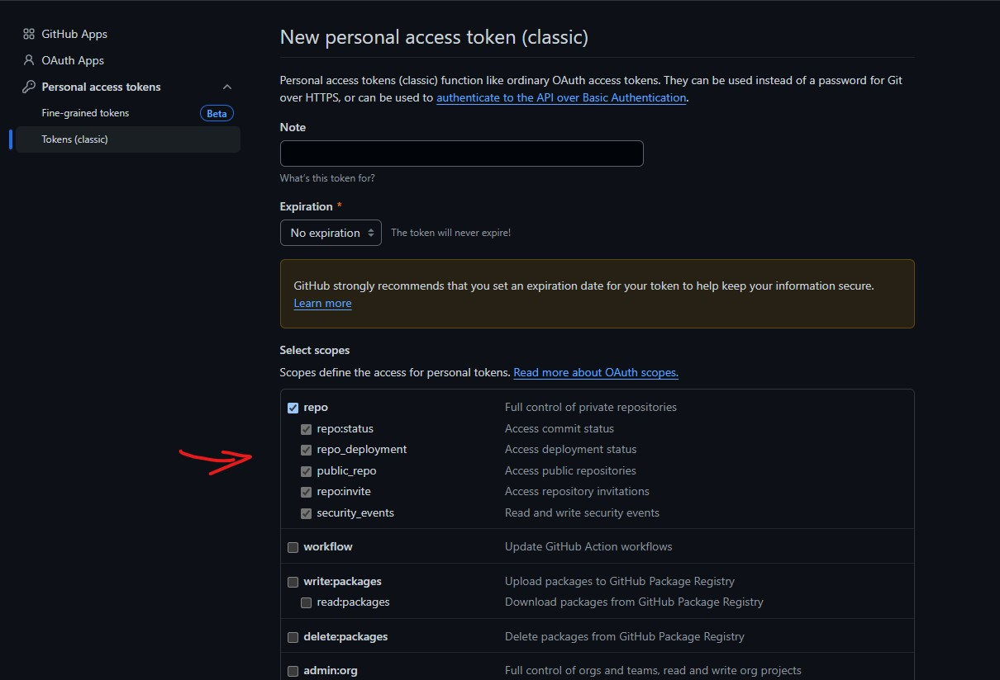

# Versify - A simple CLI tool for managing versions

**Version 1.0 is here!** :rocket:  
Now Versify works with commands to create a branch, update the file in the repository and... wait for it...  
Create a pull request directly from the CLI itself!

## How to install

First, install the crustacean language [Rust](https://www.rust-lang.org/tools/install).  
The next step is to clone the repository and then ``cd versify``.

**Important**  
You have to set a GitHub access token in order to use the CLI.
Go to the [developer settings](https://github.com/settings/tokens) and then create a new GitHub access token (classic).    
Give the token only the repository permissions and that should be enough.



The last step is to set the GITHUB_TOKEN variable in the .env file (rename the .env.example). 

Finally, to install the CLI tool to your path just run:

````bash
cargo build && cargo install --path .
````

That's it? Yes, now you can use the tool to modify the version of any application :cowboy_hat_face:

## Usage

<i>Help</i>

````bash
versify --help 
````

## Commands available:

- list: List all branches of the repository
- download: Download packages.txt
- create-branch: Create a new branch
- update-branch: Update the package.txt in the created branch
- create-pr: Create a new pull request
- update: Update the package.txt in your current PC (TO BE DEPRECATED)

To see the list of options for any command run ``versify <COMMAND> -h``

## Example

### List all branches

````bash
 versify list 
````

### Download packages.txt (optional)

````bash
 versify download -b 23-9-x 
````

<i>Options</i>

- -b, --branch <BRANCH>: Choose the branch in the repository. By default, it'll pull the packages.txt from main
- -o, --output <OUTPUT_PATH>: Choose the output directory. By default, it'll create a new directory called "tmp" in the
  current working directory
- -h, --help: Print help

### Create a new branch

````bash
 versify create-branch <SOURCE> <NEW_BRANCH> 
````

SOURCE: The source branch that will be used as the base of the new branch  
NEW_BRANCH: The name of your new branch

### Update packages.txt in the new branch

````bash
 versify update-branch -m "This is a commit message" -t test-branch -d SSIV -v 1.7.2769.0  
````

You can change several versions at once for different apps (comma separated).   
The number of versions <strong>MUST</strong> match the number of domains to be changed, otherwise an error will be
thrown.
<br>

<i>Options</i>

- -m, --message <MESSAGE>: Commit message
- -t, --target-branch <TARGET_BRANCH>: Target branch to be updated
- -d, --domain <DOMAIN>: The name of the domain you want to modify. This is a list of valid domains: SATK, Mashup, SSC,
  SSIV, SCE, HCS, ImageImport, ImageDiscovery, SciStream, Metastore
- -v, --version <BUILD_NUMBER>: The build number of the apps, e.g. 4.0.8.10268
- -h, --help: Print help  
  <i>Optional</i>
- -p, --path <PATH>: Path to the file directory (Only if you want to update a file in your PC instead of commiting the
  changes directly to the repo)

### Create pull request

````bash
 versify create-pr -t "This is the PR title" -m "This is the message body of the PR" --branch test-branch --target-branch 23-9-x
````

<i>Options</i>

- -t, --title <TITLE>: Pull request title
- -m, --message <MESSAGE>: Pull request body message
- --branch <BRANCH>: Source branch (i.e. your current working branch)
- --target-branch <TARGET_BRANCH>: Target branch (i.e. the branch where the changes will be merged)
- -h, --help: Print help

### Update local packages.txt (To be deprecated in a future release)

````bash
versify -p C:\<PATH>\packages.txt -d SSC,SCE,SATK -b 4.0.8.333,1.6.4.5,5.3.33
````

<i>Options</i>

- -p, --path <PATH>: Path to the file directory
- -d, --domain <DOMAIN>: The name of the domain you want to modify. This is a list of valid domains: SATK, Mashup, SSC,
  SSIV, SCE, HCS, ImageImport, ImageDiscovery, SciStream, Metastore
- -b, --build-number <BUILD_NUMBER>: The build number of the apps, e.g. 4.0.8.10268
- -o, --output <OUTPUT_PATH>: Choose the output directory. By default, it'll create a new directory called "output" in
  the current working directory
- -h, --help: Print help

## TODO:

- <del>Create a new branch and a pull request using GitHub API
- <del>Add option to select a desired output directory
- Integration with Jenkins (maybe)
